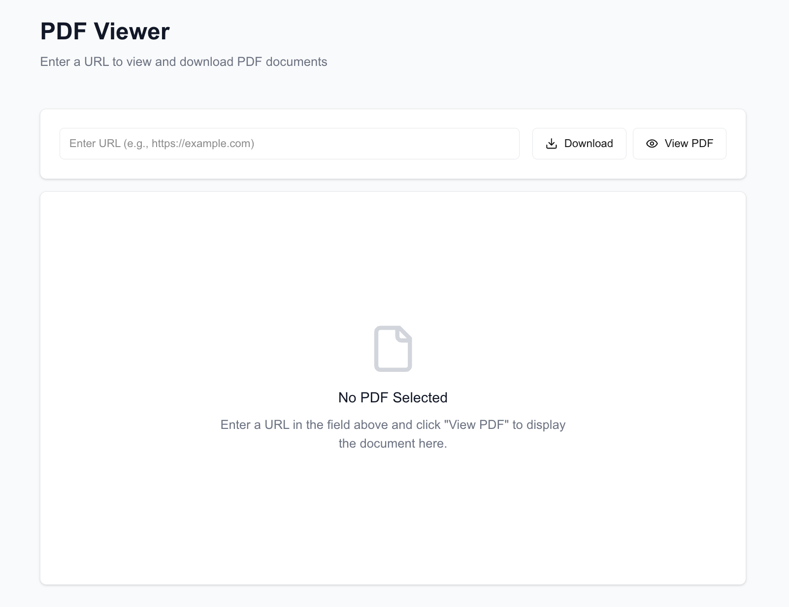
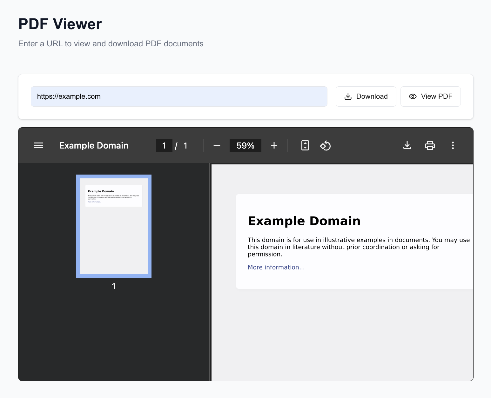

# Project Name

This is a web project built with Next.js and styled using Tailwind CSS.

## Requirements

- Node.js 22+

## Environment Variables

You must define an environment variable named `BROWSERLESS_TOKEN`.  
This token is required to access the Browserless API and can be set in a `.env` file or through another environment configuration method.

Example `.env` file:

BROWSERLESS_TOKEN=your_browserless_token_here

## Getting Started

First, install the dependencies:

```bash

npm install  
# or  
yarn  
# or  
pnpm install  
# or  
bun install

```

Then, run the development server:

```bash
npm run dev  
# or  
yarn dev  
# or  
pnpm dev  
# or  
bun dev
```
Open http://localhost:3000 in your browser to view the application.

## Preview




## Project Dependencies

- Next.js  
- Tailwind CSS

## License

MIT
